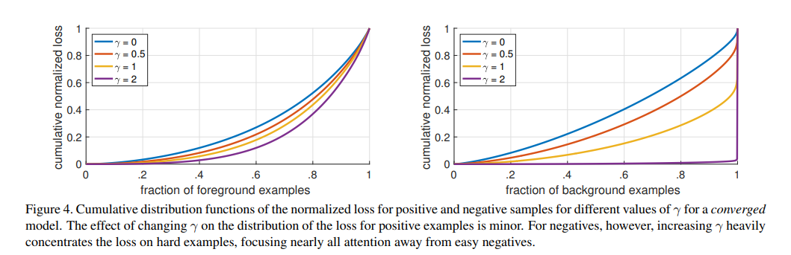
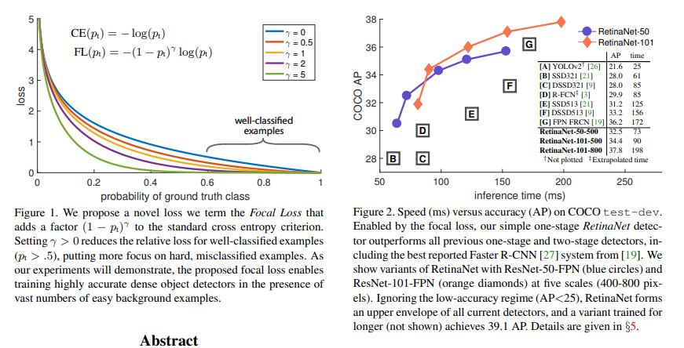
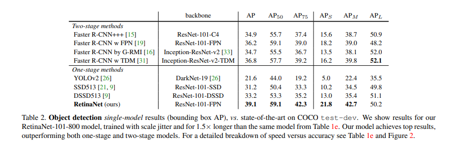
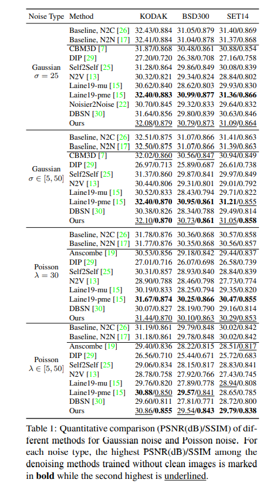
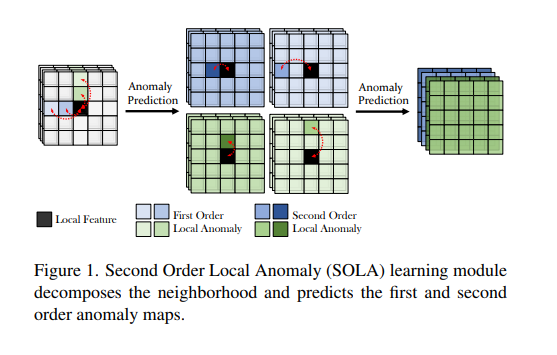

Digital images inevitably incorporate noise degradation due to inherent sensor noise or numerical errors in the optical or electronic capturing process.  
Image restoration (IR) attempts to reconstruct high-quality clean image from corrupted example 

