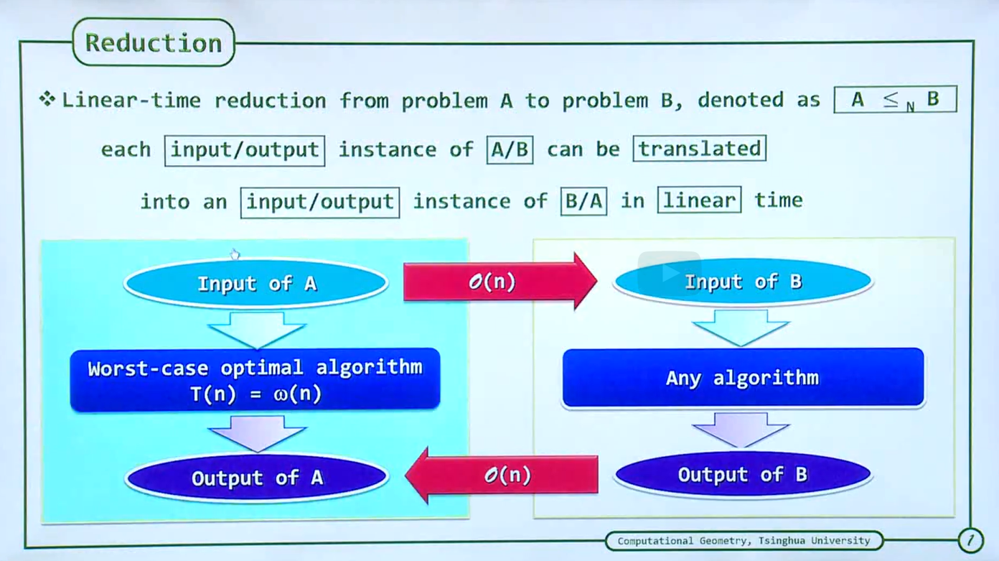
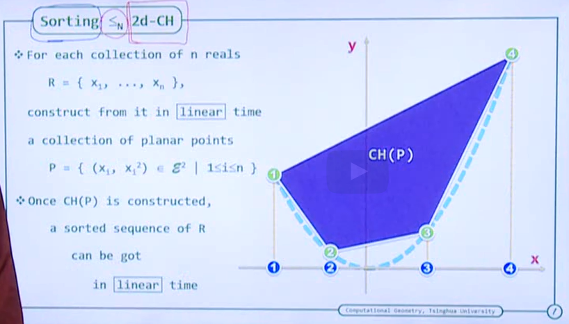
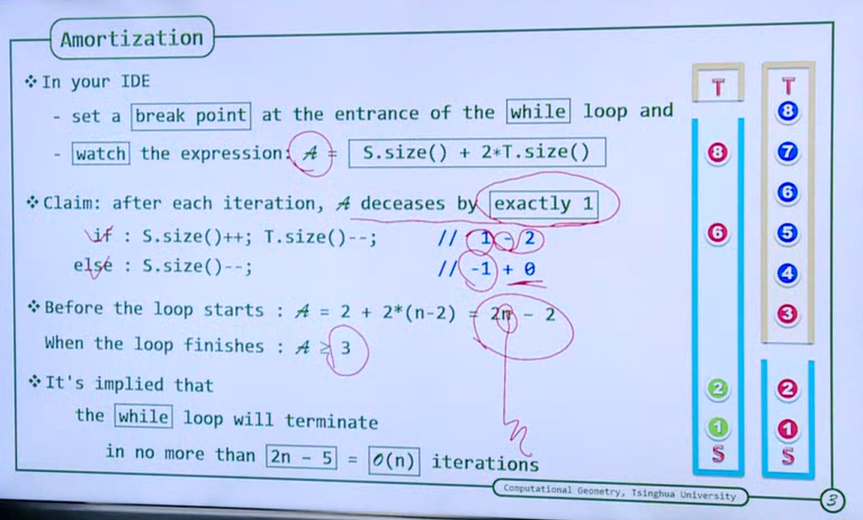

The link of OJ is http://dsa.cs.tsinghua.edu.cn/oj/

MIT OCW https://ocw.mit.edu/courses/2-158j-computational-geometry-spring-2003/

# **计算几何 | Computational Geometry**

## Convex Hull

**What is a convex combination**

### Extremity

如何构造凸包

如何确定极点

1. 判断每个点是否在任何三角形的内部， 但是$O(n^4)$ 

### To-left Test

3条有向直线

问题是如何高效的处理？

### Extreme Edges (EE)

如何判断极边

所有的其他点都在 左侧

比极点快一个量级 $O(n^3)$

### Decrease and Conquer

新引入新的点，加入已有集合

Incremental Construction for generating convex hull

#### In-Convex-Polygon Test

二分法 $O(log_n)$

但是不能行的通，因为多边形一直在变，预处理是没有效力的

全遍历边$O(n^2)$

#### Support Line

### Selection Sorting and Jarvis March

#### Coherence

拐角最小的边就是EP, 但是太慢了

所以用To-left Test, 回避除法和函数运算

排序任务的特例，点在右边即更新

#### Degeneracy - 有平局情况，存在歧义

##### lowest-then-leftmost (LTL)

Output Sensitivity: GW Algo $O(nh)$

### Lower Bound

#### Reduction

曹聪称象

$|A|$表达$A$问题的难度

Convex Hull is $O(nlog_n)$

Proof Case: **Sorting $\leq_N$ 2d-CH**, 即决定下界

点在x轴上单调，即可以转换为排序问题

### Graham Scan - optimized algo

$O(nlog_n)$

1. Pre-sorting (To-left test)

   

   OR

   

   **How to pre-sorting?**

   To-left Test comparator (Polar Angle Order)

   If the array is already sorted in other way? 

   

   以负无穷远为边界，即可以视为Polar Angle Order，Graham可以为上凸包。反之。

   

   

   

   

   

2. Two Stack: S and T

T 会耗尽， S 只包含了凸包的顶点，且是逆时针的

3-4-5 is right turn, pop out 4, push in 5.

make sure every thing is left-turn

###  Proof  Graham的上界紧密性

图论：According to Euler's formula, Vertices+Faces-Edges=2,

Amortization: 

