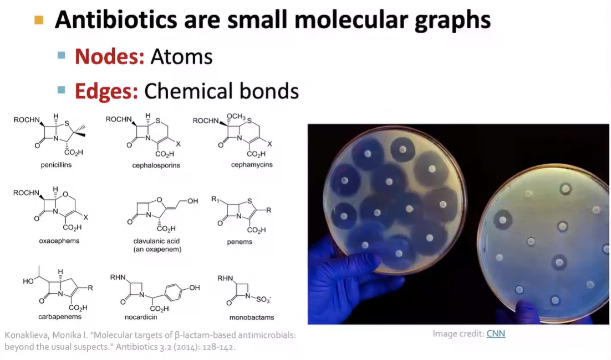
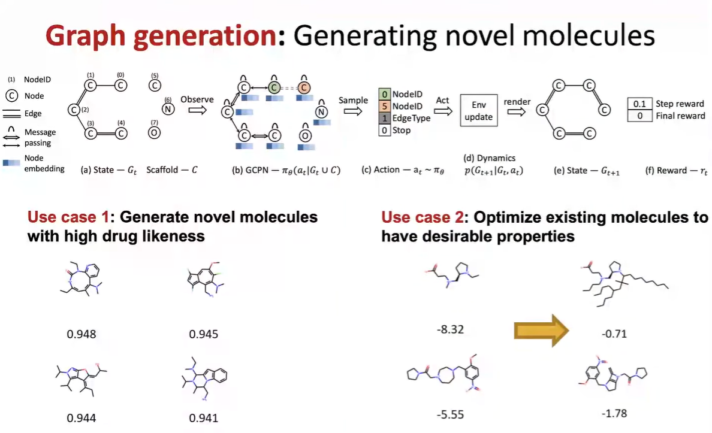
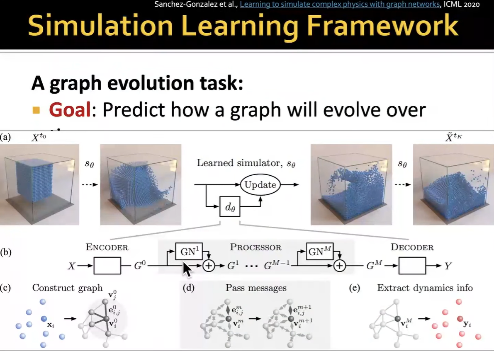

### Node Level ML Application

##### Protein Folding

How to predict its 3D amino and sequence structure

AlphaFold represents the Protein as a graph

### Edge Level ML Application

##### Recommender System

Image + Graph Structure

Such as PinStage Graph

##### Drug Side Effect

Many Patients take multiple drugs to treat *complex* or *co-existing diseases*.

### Sub-graph Level ML Application

##### Traffic Prediction

### Graph Level ML Application

##### For drug discovery

##### And classify molecules (toxic or not?)

##### Physical Simulation

