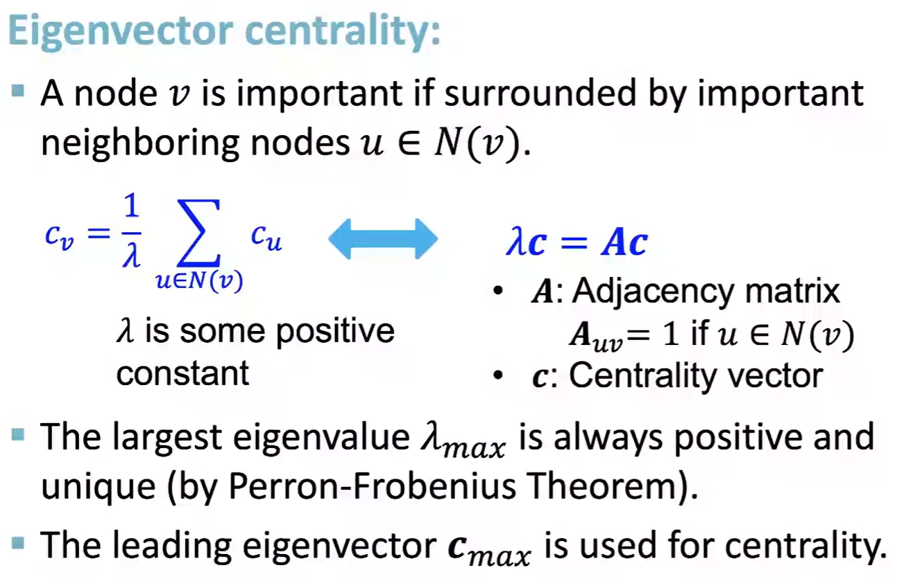
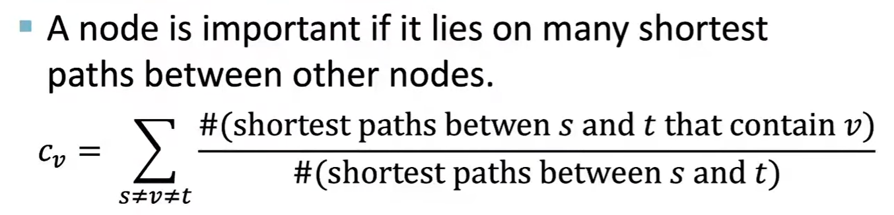
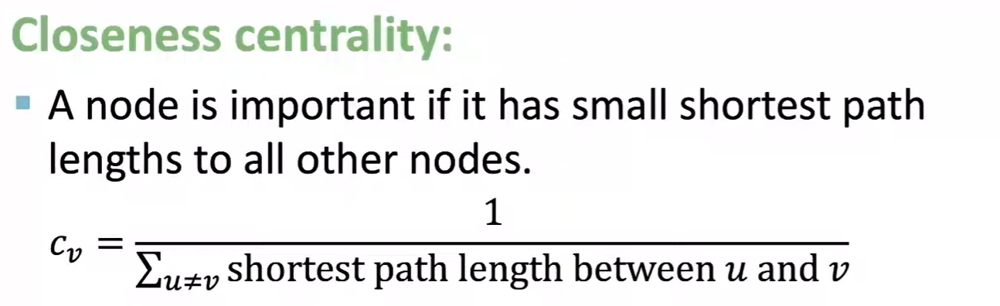

### Feature Design

Attributes of the nodes (such as the structure of the protein)

### Node-level Feature

- Node degree: $k$ 

- Node centrality: $c$

  How important this node in a graph

  - Eigenvector centrality

    

  - Betweenness centrality

    

  - Closeness centrality

    

- Clustering coefficient

  measure the local structure
  It counts the triangles in the ego-network (import to such as friend network)

  

- ##### Graphlets

  Rooted connected non-isomorphic subgraphs

  Not just count triangles,

  

  ##### Graphlet Degree Vector (GDV)

  

### Link-level Feature

The task is to predict **new links** based on existing links

##### As a Task

##### As a Proximity

##### Features

- Distance

- Local neighborhood overlap

  

- Global neighborhood overlap

  **Katz Index:**

  

  

  The power of Adj Matrices

  

  

### Graph-level Feature

Goal: We want features that characterize the structure of an entire graph.

##### Kernel methods:

##### Why Graph Kernel?

##### Graphlets Kernel

Count the number of different graphlets in a graph.

**Limitation**: counting graphlets is expensive -> takes $n^k$, with graph size n, size k graphlets

##### Weisfeiler-Lehman Kernel (WL Kernel), color refinement

Color refinement vector?

