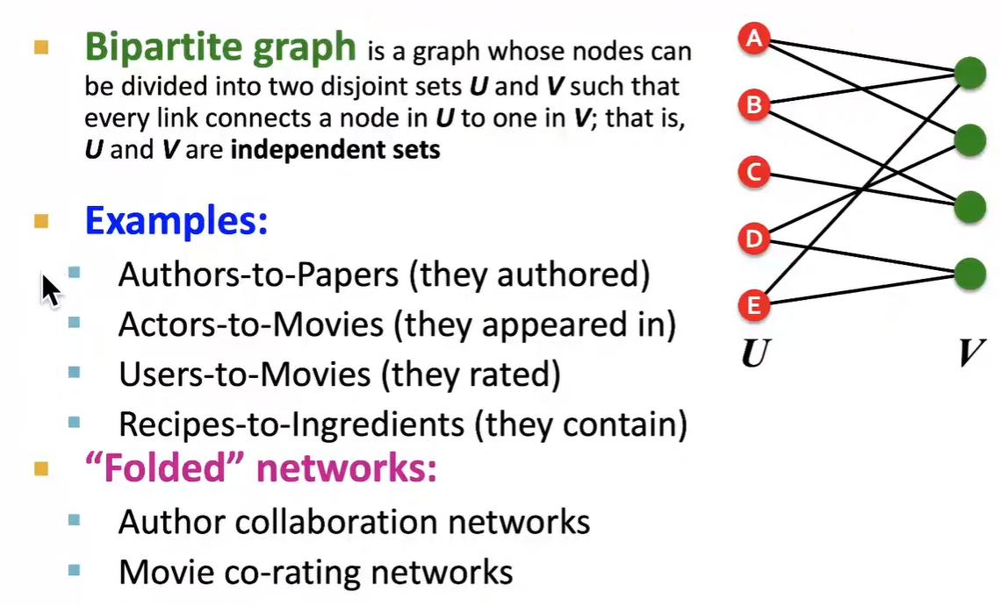
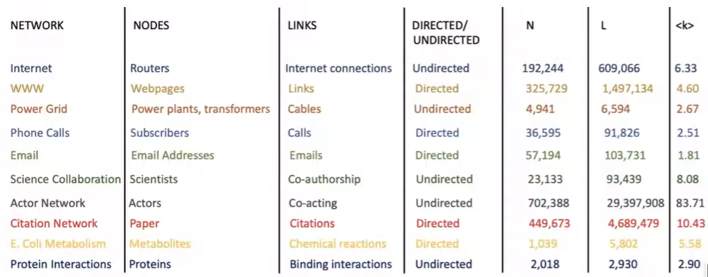
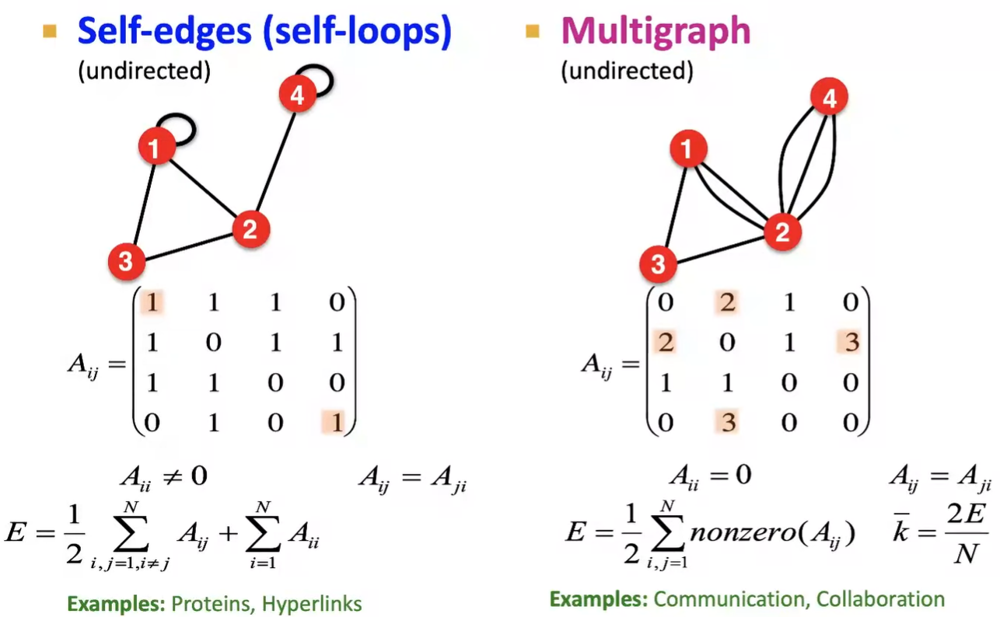

##### What are nodes?

##### What are edges?

##### Directed or Undirected? 

### Node Degree

### Bipartite Graph

For example in **U**, *(1,2,3)* is the co-authors for Paper *A*

### Adjacency Matrix

But this matrices are sparse

Not body will have 7M friends!!

### Edge List

It is friendly as a 2D data, but it is non-trivial for computing such as $k$.

### More types 

Happens frequently in nature, such as phone call

