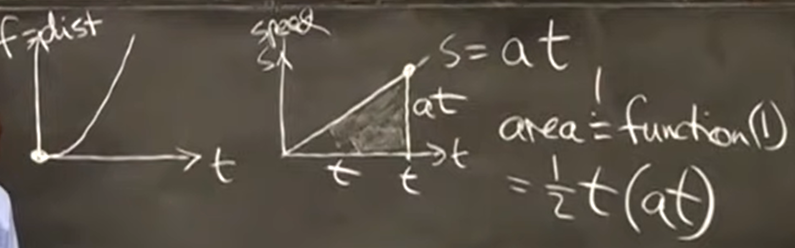
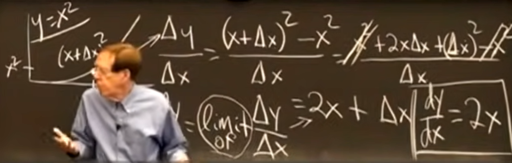
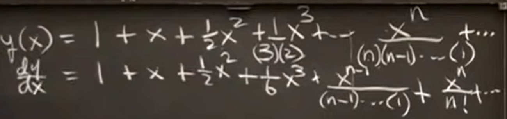
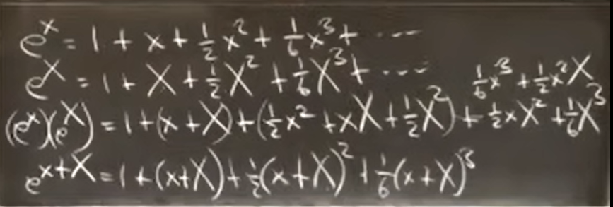

Link: https://ocw.mit.edu/courses/res-18-005-highlights-of-calculus-spring-2010/video_galleries/highlights_of_calculus/

### Word

Parabola

# Big Picture of Calculus

It is related to two functions:

Function (1) = Distance — $f(t)$ or $y(x)$

Function (2) = Speed — $S=\frac{df}{dt}$ or $S=\frac{dy}{dx}$

Or Height/ Slope

# Big Picture: Derivatives

at every instance

# Max and Min and Second Derivative

Second derivative tells me bending of the graph

Acceleration $\frac{d^2f}{dt^2}$

# The Exponential Function

The derivative equal to itself:

$$
e^x = y(x)=\frac{dy}{dx}
$$

second important infinite theory 
$$
e^x=1+x+\frac{1}{2}x^2+\frac{1}{6}x^3+\cdots
$$
The most important infinite theory (Geometric Theory, succeed when $x<1$)
$$
1+x+x^2+x^3+\cdots
$$
e is called Euler’s number $\approx 2.7818$

**Bank Compounding Interest**: 102% every year

calculus said cut the step down, every year to every day? How about separated into more?

To much, it will no more than $e$
$$
e = (1+\frac{1}{N})^N
$$

# Intergral

little $\Delta x\to0$

