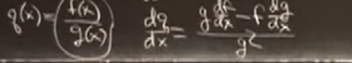
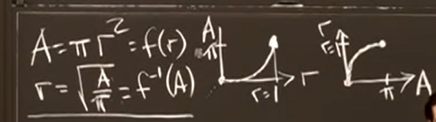

## Product Rule and Quotient Rule

$$
q(x)=\frac{f(x)}{g(x)},\frac{dq}{dx}=\frac{g\frac{df}{dx} - f\frac{dg}{dx}}{g^2}
$$

## Limits and Continuous Functions

$$
a_n\to A\ as\ n \to \infin
$$

## Inverse Functions f ^-1 (y) and the Logarithm x = ln y

