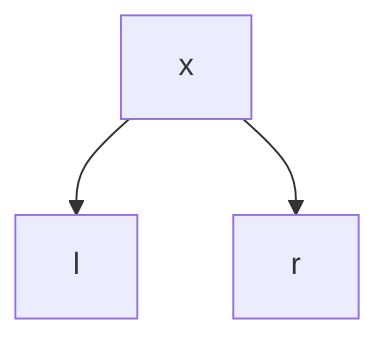
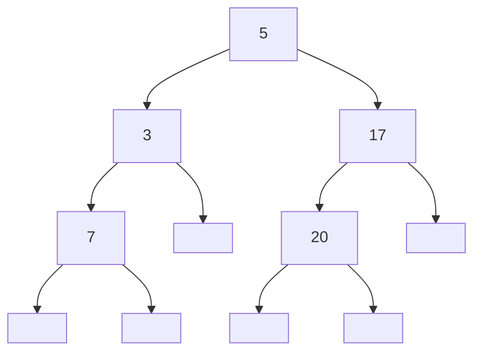
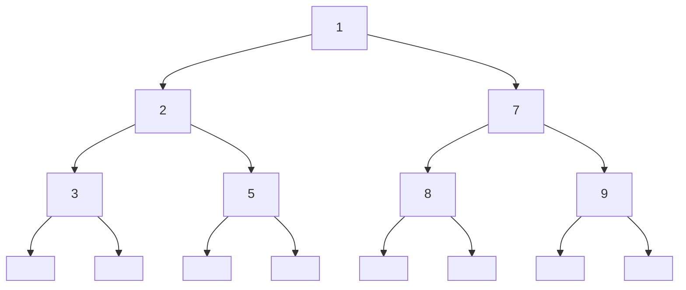
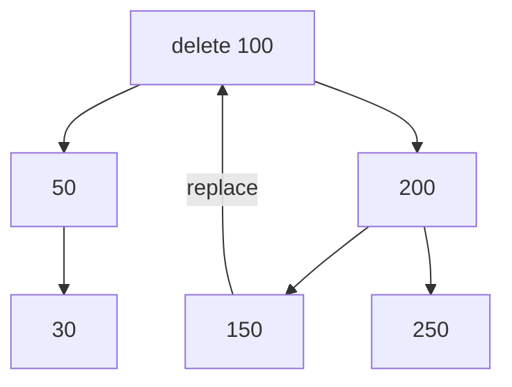
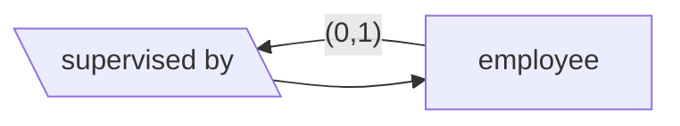
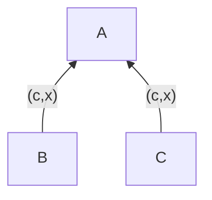
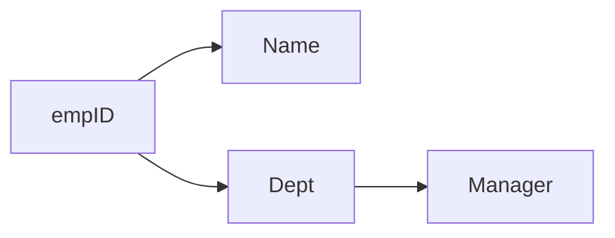

---


layout:     post
title:      "Data Structures, Algorithms, and Databases"
subtitle:   " \"Data Basic\""
date:       2022-02-08 12:00:00
author:     "Calvchen"
header-img: "img/post-bg-infinity.jpg"
catalog: true
tags:
    - Algo
    - Data
    - Database
    - Course


---

> “Basic data courses. ”


# Data Structures, Algorithms, and Databases

- **Kinds:** Array, List, Trees, Tables, Graphs
- **Algorithms:** Sort, Insert, Delete, Find
- **Efficiency:** How fast? How mush memory?
- **Abstraction:** How to use? (abstract) How to implement? (concrete)
- **Specification:** What we want the algo to do?
  - Reason about its con-time complexity and space complexity

**Preconditions** is the condition that is **assumed to hold** at the beginning of the program.

**Post-conditions** is the condition that is **guarenteed** to hold at the end of the program.

**Invariants** is the condition that is **expected to hold** at the beginning of each **loop** iteration

**Assertions** is the condition that is **expected to hold** at the point where it is placed


### Array


How to store? **row-major or column major**: store by which

In column major, there we see that the row index is changing most rapidly,


Array is great if you want to move the end

But we have **constant time access** to them


Removing is $O(n)$cause we gotta move all those elements.

### Dynamic Array

Resizable, copy the old array in the new location (Double size)

Also serve constant-time read and write


Removing is $O(n)$cause we gotta move all those elements.

### Amortized Analysis: Aggregate Method


N operation / N


It is like amortizing loan. Why the below is true?


### Singly-Linked Lists

List elements need not be contiguous.

A key term and a pointer


Insert: first create the node, update the pointer to the first number. Then update the **head pointer**


Other like remove will be the same. But getting last element is expensive.

So some times we have **tail pointer**.

It can still be **expensive** when we remove the last term because we need a pointer to *13* to update the tail (Go through the array from the top).


If before the insertion, the head and the tail were nil,

so it was an empty list so we've gotta update the tail

**Remember to:** check **empty** and **only one element?**


In case there is only one element in the list, and get empty.


Fast AddAfter….


### Doubly-Linked Lists

There is a way the get the pushback cheap


But we need to manage both pointer


### Stack

can be based on Array

We can Push(Key), Top() and Pop().

**Remember:** Check if **empty**.

It can used to track the **Balanced Brackets**


### Queue

can be based on linked list (with max size)

It is a FIFS or FIFO situation

Enqueue (Key): Add key to collection.

Dequeue (): Remove the least recent key, which means the head from the front, not the tail.

Empty ()


Or implement with array (wrap around)


## Search

Given an array $a$ of $n=a$ interges, then given $x$

Find an interge $y=i \text{ (for index)}$ if found, **-1** if not found.

**What if more than one found?**

- We can return the first one found.


**Linear search** on average the algo takes $\frac{n+1}{2}$ iterations, which is $O(n)$.

**Binary search** assume the $a$ is sorted (predcondition), normally is $O(log\ n)$.

- Does it really get faster? Significantly so?
  - Yes the worst case of perfect *BS* is $log_2\ n$.


Because of BS Invariant 


### Trees


Post-order: we evaluate all children fully before evaluating a node itself.

### Binary Search Tree (BST)

Root, Descendant and Sibling.

**Level** = 1+ edge between itself and root

**Height** = maximum depth of **subtree node** and leaf

If we want to **insert** and **delete** elements efficiently, it will require using BST.

**Delete and insert from sorted array**

- Find the element takes $O(log\ n)$
- Shift left $z$ portion of the array takes $O(n)$, we don’t want this happened.
  - Delete require the left $z$ portion of the array to shift
  - Insert require the array to right $x$ portion to shift right

**Sorted list**:


TCarry out logical design for the model, representing the design with relational
schemas for tables. Annotate the schemas with primary keys and the possibility
of null attributes.he solution will be: ***Sorted Tree***.

How to build it?

- Step 1: Have the empty tree, writen as *Empty* or $\Box$, represent by \*. 
- Step 2: Given label $x$, $l$ and $r$, represents root, left and right subtrees. we can build a new tree $\text {Fork}(x,l,r)$, 



Nodes is the number of roots, dispite the end subtrees.

Height is the max depth of the Nodes.



Which Nodes = 5, Height = 3. The height grows logrithmically.

Leaf is the node with two empty tree. 

**Formulas to calculate:**

For convenience, we use abbreviation for short:
$$
\text{Use }n(\cdot)\ \&\ h(\cdot)\text{ for \#nodes}(\cdot)  \ \&\ \text{height}(\cdot) \\
\text{Use F for Fork}(x,l,r) \\
$$
So we have
$$
n(\Box) = 0,\ h(\Box) = 0\\
n(\text F) = 1 + n(l)+n(r)\\
h(\text F) = 1 + \max(\ h(l),h(r)\ )
$$
**Perfectly Balanced Tree** **(PBT)**

The right and the left tree of any node have the same height



**Formulas**
$$
\text{isPB}(\Box) = \text{true}\\
\text{isPB}(\text F) = (\ \text h(l)==\text h(r)\ )
$$
The number of nodes of whole PBT is $2^{\text(height)}-1$, of each layer is $2^{\text(height-1)}$.

If the tree is nearly balanced, the worst case of searching is $O(log\ n)$.

**Complete Binary Tree**

Filled from left to right.


**ADV:** linear search time, and can be stored as array


We need to ensure the tree is complete.


### Insert in BST

- If already exist, we can either report an error or leave it unchanged 

Define
$$
\text{isIn}(x,t) =
\left\{\begin{array}{ll}
\text {true,} & \text { if } x \text { occurs in }t\\
\text {false,} & \text{otherwise}
\end{array}\right.
$$

$$
\text{isIn}(x, \Box) = \text{false}\\
\text{isIn}(x, \text F(y,l,r)) = (\ x==y\ ) || \text{(find subtrees)}\\
\text{find subtrees} = (x<y)\ \&\&\ \text{isIn}(x, l) ||(x>y)\ \&\&\ \text{isIn}(x, r)
$$


### Deletion

- Case 1: Delete a leaf.
- Case 2: Delete a node with only one side.
  - We move up the other subtree
- Case 3: Delete a node with both sides.
  - We replace the vacant node by the *left-most* node or ***smallest* node of the right subtree**.



> All cases take $O(log\ n)$ steps assuming the tree is balanced.


### Tree Traverse

**Depth-first**: completely traverse one sub-tree

Three can used a Stack:

InOrder: left-node-right

PreOrder: node-left-right

PostOrder: left-right-node

**Breath-first**: Traverse all the node at one level

used a queue


### Heap


### MinHeap, MaxHeap and Binary Heap


**Shift down**: swap parent node with larger child


How to remove, boiled down to 2 steps:

1. Change the root priority to $\infty$
2. Heap the tree, move it to the root node
3. Replace the root node with the last leaf (7 in this case)
4. Heapify

Time complexity $O(H)$

But insert will destroy the balance.


#### Heap Sort

Sort using priority queue


Build heap from the last sub tree to the root.


## AVL Trees

Adelson-Velski and Lzudis Trees or called **self-balancing Binary Search Tree**

BST tend to grow unbalanced, we then lose the $O(log\ n)$ good time behavior. Can we assume extra conditions to make sure that the height of the tree is under control?

**Why we will lose it?**

The extreme case that all the nodes come in one line will perform like linear search.


Assuming space is $O(n)$ for both. 

The worst case of BST is $O(n)$, but AVL remain still $O(log\ n)$.

**How to do it?**

- Assume additional conditions to keep the trees balanced.
- Define some concepts before we can state these conditions.

**Concept #1** **Height of the node** 

Length of the *longest* path from that node to the leaf node

Equal to the height of the subtree at that node.

**Concept #2** **Balance at the node**

**(Height of left subtree) - (Height of right subtree)** 

perfectly balanced, that is, the balance of each node is 0.


height of empty tree is -1, 

Then height of subtree at that node will be height of left subtree + 1 (for the node itself). Same is true if node has only right subtree.

**Concept #3** AVL tree

the balance at every node is $-1, 0 \text{ or } 1$.

Why consider this concept?

- Difficult to get perfectly balanced trees.
- Easier to keep trees AVL balanced.
- AVL balance is good enough to get fast algo.

**Concept #4** Perfectly Balanced Tree

The balance of every node is **0**.

General, we have: 
$$
n=2^h-1
$$
It is the best case of AVL Tree.

What is the **worst case**: 

>  We now use Fibonacci numbers.

Here, $F(\cdot)$ for Fibonacci function (start from 0 and 1).
$$
F(k) = \frac{\left(\frac{\sqrt(5)+1}{2}\right)^k - \left(\frac{\sqrt(5)-1}{2}\right)^k}{\sqrt 5}=O(1.61^k)
$$
And we have
$$
F(h+2)-1 = n
$$
Always, we have lower and upper bound of number of nodes:
$$
F(h+2)-1 \leq n \leq 2^h-1 \\
O(1.61^k) < n < 2^h
$$
Why we don’t specify the base of $O(log\ n)$?
$$
log_{10}(n) = O(log_2(n)) \\ 
log_{2}(n) = O(log_10(n))
$$
Only different with a constant factor, so it doesn’t work for O notation.

**Back to AVL Tree**

From the lower and upper bound, it implies $h = O(log\ n)$, which is something we didn’t have for BS trees.

- Invariant:
  - The balance of every node is -1, 0 or 1.

**Algo for AVL trees**

- Search: Now it really is $O(log\ n)$.
- Insert & Deletion: As before, but additionally no necessarily rebalacing. 
  - Fisrt BST method
  - Check AVL balance and fix it if necessary.
  - Can be done in total time $O(log\ n)$.

AVL Insertion Example


Need to fix the resulting tree…

Four Result Cases:


AVL insert Case LL: **Right Rotation**


AVL insert Case RR: **Left Rotation**


AVL insert Case LR: 


AVL insert Case RL:


**AVL Tree Deletion**

- Delete using the BST algo
- Rebalance as necessary as before.

Replace the largest (=right-most) node of the left
subtree, or by the smallest (=left-most) node of the right subtree, deleting the
replacing node.

AVL trees have height of O(log n) even in the worst case.

Each Rotation takes a constant time. 

So all **rebalancing operations** can be done in O(logn) time as well

### Fibonacci Trees

$$
T_{-1},T_0, T_1,\dots
$$

T−1 is the empty tree • 

T0 is the one element tree • 

Th+2 is obtained by making Th and Th+1 children of the root node (as shown in the picture on the previous slide)


## Dataset

### Entity-relationship concepts

**What is a database?**

•It is a large collection of persistent data

•Typically stored on a **server** somewhere on the **net**

•Accessible from multiple applications on client computers

•Concurrently accessible and modifiable

•Expected to be secure and efficient

•Expected to be fault-tolerant (can recover from crashes). No data losses!

**Why we need database?**

Meant to suggest the “base of data” on which all the applications run.

Or internal data of organizations/ businesses


### Relational Databases

Built as a relational database management system (DBMS or RDBMS)

is a collection of tables (relations)

**Inside a Table**

Columns (attributes, felds)， Rows (records, tuples)

Null (marked as “-‘)

**Tables/Relations**

**Attributes/Columns/Fields**

**Records/Rows/Tuples**

**Schema** = Names of relations, attributes and their types

**Key** = Any attribute(s) that is unique across all the rows

**Primary key** = A designated key that is meant to uniquely identify the records.

### Entity-relationship (ER) modelling 

All the “things” for which data needs to be kept are **entities**.

In addition, there are also **relationships** between entities can described in one-sentence description.

We depict entities by **rectangles** and relationships by **diamond boxes**, attributes are **oval** boxes (not a must element).


**Attributes** (for both entities and relationships)

**Book**: Author(s), Title, Publisher, Year of publication

**Member**: Membership number, Name, Address, Date of joining

**borrowed**: Date of borrowing, Due date, Return date, Fine (if any)

### Multiplicities

Number of times the entity can **participate** in the relationship

For example,

- A book may or may not be borrowed. If it is borrowed, there is only one borrowing.
- So, minimum = 0, maximum = 1.


Here the Book class is an **entity set** contains of many book **entities**.

**(1,1)** is a special case that defining a constraint.

Example:

- (0, 1) :The **instance** appears at most once in the relationship. An employee may or may not be supervised
- (1, 1) : The **instance** must and will appear exactly once in the relationship.
- (0, n) : the **instance** may appear more than once. Such as a customer may have placed many or no order in a given time interval.
- (1, n) : The **instance** appears at least once but can appear many times.

[ER Graph Example](#ER Examples)

### The design and creation

By **default,** every entity and relationship in our ER model becomes a **table** in the database, written in **schema** notation.

**Constraint**: Also we have unique identifiers for each entity, the relationship table table must necessarily occur in this field.

### Table design

The 3-table design for this model:

- Book (<u>book id</u>, authors, title, publisher, year)

- Member (<u>member id</u>, last name, first name, address, date of joining)

- Borrow (<u>book id, member id</u>, borrow date, due date, ~~return date, fine~~)

> We can also use tables for this model, if we ignore **fines**
>
> 1. We can add the Borrow fields to the Member table
>
>     (book id, borrow date, due date, return date, fine)
>
> 2. Or to the Book table 
>
>    (member num, borrow date, due date)

**The issue after optimisation 1** 

We must allow some attributes can be **null^o^**. 

And it won’t work if we permit multi-borrowing.

It is not a good idea to hard-wire business policies into the database design! 

**The issue after optimisation 2**

We must allow some attributes can be **null^o^**. 

we cannot represent the **fines** (charge) satisfactorily in this design.

- Perhaps we can add the Borrow fields to both the Book table and the Member table?
  - It would introduce redundancy in the design

**Summary:**

- If a **relationship** has (0, 1) or (1, 1) multiplicity with an entity, its table can be merged with that of the entity. 
- (0, 1) should allow null.


### Weak entities

Suppose our library has **multiple copies** of some of the books.

Suppose our library allows **family memberships**.

How do we deal with it?

> **Weak entities**: depend on some other entity for its identity.

A weak entity’s **primary key** consists of the primary key of its main entity (owner entity) and some additional attributes.

- Copy dependent on Book.
- Borrower dependent on Member.


What happen if just one copy or the member itself want to borrow books?

#### Table for weak entities


**Other examples**



### Hierarchies

Represent **is-a** relationship.

> UG student is a student.

**Example – Customer hierarchy**


Two features need to be specified.

- Coverage (**t/p**)
  - Do subclasses **totally** cover all of the superclass? Or **partially**?
- Overlap (**o/e**)
  - Are the subclasses **overlapping**? Or **exclusive**?

### **Table for Hierarchy**



Three possible ways:

- Keep all three 

  - simplest and always applicable
  - superclass (common attributes) inherited by B and C subclasses (additional attributes)

- Keep A, and omit B and C (Only superclass)

  - need to add a **variant** attribute specifying the subclass type
  - the attributes corresponding to other types will be null
  - always possible

- Keep B and C, and omit A (Only subclasses)

  - respect to superclass table which is not stored 
  - some attributes are **duplicated**
  - only possible if the coverage is **total**, and overlap is **exclusive** (redundancy).

  

**redundancy** makes it confusing that don’t know where to find the data


### Relational DBMS (SQL)

A database management system (DBMS) is a software system (made by providers like IBM, Oracle, Postgres, MySQL).

- Creating tables.
- Querying tables for finding information.
- Adding, deleting or modifying records in tables.
- **Ensuring that constraints** continue to be satisfied during modifications.

#### SQL

**SQL command to create the entity**


- **unique** and **“not null”** keyword. All fields can be null by default (a bad feature of SQL!)

- The **primary key** declaration says that the bookid field can be used for uniquely identying records. (It is redundant in this case.)

- **varying** defined the maximum length of attributes.

  

**SQL command to create the relationship**


- **reference**: declare that the corresponding entity id fields, cannot be **null**

- The id fields *together* uniquely identify a **record** in this table.

  

**SQL query examples**

- This query finds the id number of Jane Austen’s *Pride and Prejudice*.

```sql
select bookid
from book
where authors = 'Jane Austen'
	and title = 'Pride and Prejudice';
```

- With a minor variation, we can ask it to tell us **whether the book is available** or it has been issued out to somebody.

```sql
select 'not available';
from book, borrow
where book.bookid = borrow.bookid
   and authors = 'Jane Austen'
   and title = 'Pride and Prejudice';
```

### Some questions you might think about

- Our table has a single field for all the authors of a book. Can we list each author individually, somehow?

- If we have multiple copies of books in the library, what can we do?

- If we want to allow a member to borrow to multiple books (say 4 books max), what changes do we need in the design?

- If membership is actually “family membership” so that anybody in the family can borrow, do we need to change the design in anyway?

- The “primary key” of the borrow table consists of two fields. Do we need two? Can we make do with one field only?

Learn some SQL!

### SQL data types

- INT (or INTEGER), DECIMAL(n, m) with length of n and m digits
- BOOLEAN, CHAR(n), VARCHAR(n)
- TEXT, DATE, TIME

### SQL commands for tables


- **not null**: not designated as possibly null in the schema
- **references**: constraint for all references into other tables (including superclass)

**How to generate ID number?**

In standard SQL, we can declare

```sql
create sequence staffid_seq;

create table Tech(staffid integer DEFAULT nextval(staffid_seq); ... )

create table Admin(staffid integer DEFAULT nextval(staffid_seq); ... )

```

This creates a sequence generator in the database and generate a new integer value each time.

**Foreign key** 

Fields with “references” constraints are called foreign keys.

The DBMS ensures that, whenever we insert a record with a foreign key value, that value is *actually present* in the **referenced table** (Synchronization)

**But what happened when deleted?**

- Then the foreign key constraint would be violated!
- So blocked by DBMS (ON DELETE NO ACTION)

### Constraint

They allow us to **detect errors** and make sure that the data in the system is consistent and valid.

- **Field constraints** – constraint on the value of a field (e.g., **NOT NULL**)
- **Record constraints** – constraints on an entire record (e.g., you might check that the due_date is greater than the borrow_date)
- **Table constraints** – constraints on the entire table (e.g., **PRIMARY KEY** or **UNIQUE**).
- **Database constraints** – constraints that span multiple tables (e.g., **REFERENCES**)
- **referential integrity constraint**


**ON DELETE constraint**

- ON DELETE NO ACTION – default, no need to declare
- ON DELETE SET NULL
  - This **sets the foreign key to null**, if possible.
  - If null is not allowed, we get an error.
- ON DELETE CASCADE (串联)
  - The record with the foreign key gets deleted automatically.

Think of what the effect of these declarations would be when a library member quits and we try to delete their record.

What should happen to a borrow record that might still be referencing that member?


### Exercise

Identify entities, relations

We need to:

- Keep our model as simple as possible.

##### Exercise from notes (Paragraph 16(a)):

**Identifying entites**


**Which of them are really needed?**


**Identifying relationship**


**Which of them are really needed?**


Attempt exercises in Paragraph 39.

But the Exercise Sheet 1 is higher priority. We will have a quiz on it!

## Relation Algebra

Note:  that **SQL** is based on what are called "multisets" or "bags" and so does  **allow duplicates** whereas **Relational Algebra** is based on sets and so does **NOT allow duplicates**. 

**Database** = A Collection of relations (Tables)

**Relations** = Consist of **Attributes** (Columns)

Data consists of **Tuples** (Rows) and each tuple has a value associated with each attribute. 

Each Attribute has a **Domain** (Type) 

The **Schema** is the structure of the database and includes the Name, Attributes and  the Type of each Attribute associated with every relation in a  database. 

The **Instance** is the CONTENTS of the tables at a given point in time. 

All values have a type, but there is a special value that is part of all types - **NULL** (Undefined, unknown)

A **Key** is an Attribute of a relation the value of which is unique for each tuple.

Relational Algebra provides operators to **Query**:

- Filter relations
- Slice relations 
- Combine relations 


Through this session we will make use of the following tables: 

**Students:** 

| sID  | sName | sFirstDegree | sFDMarks |
| ---- | ----- | ------------ | -------- |
| 1    | Alice | English      | 77       |
| 2    | Bob   | Fine Art     | 80       |

**Modules:**

| mID  | mName       | mLecturer |
| ---- | ----------- | --------- |
| 1    | Intro to CS | BoB       |
| 2    | Databases   | Harish    |
| 3    | AI and ML   | Harish    |

**Marks**

| sID  | mID  | assignMarks | examMarks |
| ---- | ---- | ----------- | --------- |
| 1    | 1    | 15          | 80        |
| 1    | 2    | 18          | 70        |
| 2    | 1    | 12          | 81        |
| 2    | 2    | 18          | 66        |

AND operator: ∧ (Caret)  

#### Select Operator $\sigma$

ρ_\text{M1( M1.mID, M1.mName, mLecturer )}\text{(Modules)
$$
 \pi_{cid, sid}(\sigma_{year=2020}lecturing)
\\⋈\\
\pi_{cid, sid}(\sigma_{year=2021}lecturing)
$$
To pick a subset of the **rows** from a relation. 

The symbol for the Select Operator is: **σ (sigma)**
$$
\sigma_{(condition\ ∧\ condition ...)} <Table Name>
$$
For example:
$$
σ_{sFDMarks\ >\ 77\ ∧\ sID\ >\ 1} Students
$$
**SQL Equivalent**: 

```sql
SELECT * FROM Students WHERE sFDMarks > 77 AND sID > 1
```

Time complixity: *O(n)*

#### Projection Operator $\pi$

While the select operator picks a subset of rows, the project operator **picks a subset of columns**

For example:
$$
\pi_\text{A1,A2,...,An}\text R
$$

$$
π_{sID,\ examMarks}\ Marks
$$
SQL Equivalent:

```sql
SELECT sID, examMarks from Marks;
```

Time complixity: *O(n)*

**Making expressions** 

Since every operator returns a relation we can combine operators as follows:
$$
π_\text{sID,\ examMarks}\ ( σ_\text{examMarks > 70}\ \text{Marks} )
$$
SQL Equivalent:

```sql
SELECT sID, examMarks FROM ( 
    SELECT * FROM Marks WHERE examMarks > 70 ) 

SELECT sID, examMarks FROM Marks WHERE examMarks > 70
```

#### Cross-Product or Cartesian Product Operator $\times$

This is an operator that is used to combine two relations. 

As a notational requirement, when the **same column name exists in both the relations** then the columns in the result are **prefixed** by the name of the relation they come from. 
$$
\text{Student}\ \times\ \text{Marks}
$$
SQL Equivalent

```sql
SELECT 
    Students.sID, sName, sFirstDegree, sFDMarks, mID, 
    Marks.sID, assignMarks, examMarks  
FROM Students, Marks;
```

**WARNING**: sID from students is named students.sID and that from Marks  is called Marks.sID which requires explicitly stating this in SQL

 

So it is not useful in SQL, unless we filter it first (equal to **join**):
$$
\sigma_\text{(students.sID = Marks.sID)}\ \text{Student}\ \times\ \text{Marks}
$$
SQL:

```sql
SELECT 
    Students.sID, sName, sFirstDegree, sFDMarks, mID, 
    Marks.sID, assignMarks, examMarks  
FROM Students, Marks 
WHERE Students.sID = Marks.sID
```

Time complixity: *$O(n^2)$,* highly **inefficient**.

#### Natural Join  **⋈ (bowtie)**

Or just **Join**, *is the **most important** operation in the DBMS.

It can be rewritten using a combination of projection, selection and cross-product. 

Performing cross-product and additionally:

1. Enforces the **equality** on all attributes with the **same name**
2. Eliminates one copy of the duplicate attribute

Students ⋈ Marks allow us to write the following as equal: 
$$
\sigma_\text{(students.sID = Marks.sID)}\ \text{Student}\ \times\ \text{Marks}
$$
simply SQL

```sql
SELECT * FROM Students NATURAL JOIN Marks 
```

Time complixity: $O(n)$ if tables are sorted by the join column, $O(n^2)$ otherwise.

**EXERCISE**: Write the equivalent Relational Algebraic expression for the Natural Join above, without using a Natural Join. 


#### inner join


O(n^2), expensive

#### Outer Join


Doing join efficient: sort the join column

One is sorted, other is not. 


#### Theta Join $⋈_\theta$

The Theta Join operator while additionally implementing a condition. 
$$
\text{Exp1} ⋈_{<condition>} \text{Exp2}
$$
SQL:

```
SELECT * FROM EXP1 JOIN EXP2 ON( <condition> );
```

is equivalent to:
$$
\sigma_{\theta}\ (\text{Exp1} \times \text{Exp2} )
$$
**Making expressions** 

List the names of the students who secured a **score of more than 80** in the final exam i**n modules taught by Bob**. 
$$
π_\text{sName} ( σ_\text{examMarks > 80 ∧ mLecturer = 'Bob'} ( (\text{Students} ⋈ \text{Marks}) ⋈ \text{Modules}) )
$$
SQL Equivalent: 

```
SELECT sName 
FROM (Students Natural Join Marks) Natural Join Modules
WHERE examMarks > 80 and mLecturer = 'Bob'
```

#### **Rename Operator** $\rho$

 Rename the Attributes but not the relation:
$$
ρ_\text{R( A1, A2, ... An)}\ (\text E)
$$
Or rename the relation:
$$
ρ_\text R (\text E)
$$
SQL Equivalent: 

```
SELECT EA1 AS A1, EA2 AS A2 ... EAn AS An 
FROM E AS R
```

#### Self Joins

While the rename operator is used for various kinds of queries, the most important is the self join which would not be possible without this. 


Example: List the pairs of modules taught by the same lecturer. 

The only way to do this is to use a **self join**. 
$$
σ_\text{( mLecturer = mLecturer)}\text{ (Modules × Modules)}
$$
Since this does not clearly tell us **which mName to equate to which**, we  must rename the two relations and the corresponding attributes. 
$$
ρ_\text{M1( M1.mID, M1.mName, mLecturer )}\text{(Modules)} \\⋈\\
ρ_\text{M2( M2.mID, M2.mName, mLecturer )}\text{(Modules)}
$$
Of course, to avoid duplicates and **A, B; B, A** we must have: 
$$
π_\text{( M1.mName , M2.mName )} (\\

σ_\text{( M1.mName < M2.mName )} (ρ_\text{M1} ⋈ ρ_\text{M2}

)\

)
$$

#### Combing Results using Set Operators

The three set operators are:

Union: $\cup$, Difference: $-$, Intersection: $\cap$

Notes: In relational Algebra these three set operators MUST be applied on the **SAME schema**. This means that if you want to find the union of lecture names and student names you MUST first **rename them**. 
$$
\text{E1} ∩ \text{E2}\ \text{  is equivalent to }
\
\text{E1 - ( E1 - E2 )}
$$

$$
\text{E1} \cap \text{E2}\ \text{  is equivalent to }
\
\text{E1}\bowtie \text{E2}
$$

### Examples


**Outer Join**


**Left Outer Join**


**Rename** operator examples:


### Self Join

**Self Join** will get same table back, but with **renaming**


Then to get rid of the useless records
$$
σ_\text{ m1ID < m2ID}
$$


Will be efficient if tables are sorted on the **primary key**.

### Sortedness in databases

- To achieve sorted order, database tables are stored in a **search tree data** structure. (**B-tree**)
- Data records are stored in the **leaf nodes**. The internal nodes only have **search keys** for navigation.
- The trees can be traversed in sorted order in O(n) time.
- **Multiple sort keys** can be accommodated by building multiple B-tree indexes for the same table.

**Semi-efficiently**: If the join column is sorted in one table R (of size n), and not sorted in the other table S (also of size n)

- We can traverse the S table in linear order and search for each key value in R.
- Since searching can be done in log n time,

- The overall time complexity is $O\text{(n logn)}$.

**Inefficient:** $O\text{(n)}$

More: Efficiency also depends on doing the operations in the right order.

> For example, consider (M⋈B)⋈C versus M⋈(B⋈C).
>
> If M is a large table, but B and C are small, the second form may be better.
>
> But if we are joining on the primary key of M, it doesn’t matter because M⋈B would be of the same size as B.

The selection operator σ should be done as early as possible, because it reduces the size of the table.

### Decomposition

Split large table into small ones

efficiency?

Or neat structural table to read or more meaningful

We use decomposition to produce tables in “**normal form**”, which do have unwanted “**functional dependencies**”.


Normally if we change the manger name, it will need to process multiple times,  but after decomposition we only need to do it once.

**How do we know to decompose this way?**

Functional dependencies:



Since **Dept** is **not the primary key** of the table, a **functional dependency on it** is a candidate for decomposition.

**functional dependency** 

We have $A_1, A_2, \dots, A_n \to B$, read as A determine the B.

B is the functional dependency on A,

>if any two rows in the table have the same values for A1, A2,… An,
>
>then they have the same value for B.


A depends on B depends on C, so we don’t need to clarify A depends on C because it is clear in the relation.


Transitivity


Closure algo


### Exercise 59 and 60 in handout.

### Candidate Keys


Here, *empID* is a candidate key that determine any other attribute in the table


#### Unwanted Key

**Redundancy**


Potential problem


**Anomalies**


Delete


Aggregate, See paragraph 66


Many lecturers are teaching same course this year..


### BCNF

has not unwanted dependency 


Decompose them


If we join this two sub-tables, we will get the origin table (*losslessness*)

But when we get new record?


We cannot have different value $W$ accociated with $U$.


### BCNF

How to get **BCNF**?


ACID


### Database Transactions


SET TRANSACTION **READ ONLY**

BEGIN TRANSACTION

•A read-only transaction can be executed in parallel with other **read-only transactions** without any worry of inconsistency.

•But they will not be executed in parallel with **read-write transactions** for the same data.

•Use this, for example, if you want to tell the user about the **availability** of all the window seats.

**READ WRITE** is default, The transaction is allowed to do both select queries and updates. 


**Dirty**

SET TRANSACTION READ WRITE
    ISOLATION LEVEL READ UNCOMMITTED
BEGIN TRANSACTION

“Dirty” data means data that is currently being modified by another transaction, but not yet committed.

If the other transactions **aborts** instead of committing, the data in our possession would have become **invalid**.


### Serializability


•Then the first client’s booking would **get overwritten**, and that customer would have lost their seat even though they have a confirmation that their seat was booked!

•The solution is to package the two steps **into a single transaction**.

•Then the server ensures that the second client gets **delayed** if it is trying to book the same seat as the first client.

### Atomicity


### Some SQL example

querying the database

A row is also called an entry or tuple or record

```sql
CREATE TABLE technicians (
    	tid SERIAL PRIMARY KEY UNIQUE
    		REFERENCES staff(staffid),
    	firstname VARCHAR(15) UNIQUE,
        lastname VARCHAR(20),
    	phone VARCHAR(20) Not NULL,
   		address VARCHAR(20) Not NULL,
        test VARCHAR(15) 
    		REFERENCES test(testid) 
    		ON DELETE  SET NULL,,
        expert_model VARCHAR(15) NOT NULL 
    		REFERENCES model(modelid)
    		ON DELETE  SET NULL,, 
    
);
```


```sql
CREATE TABLE airplane (
    	aid SERIAL PRIMARY KEY  UNIQUE,
      
        belong_model VARCHAR(15) NOT NULL 
    		REFERENCES model(modelid) 
    		ON DELETE  SET NULL,
        test VARCHAR(15)  
    		REFERENCES test(testid)
    		ON DELETE  SET NULL, 
    	airport VARCHAR(15) Not NULL 
    		REFERENCES airport(airportid) 
    		ON DELETE  SET NULL,
    
);
```


```sql
CREATE TABLE belongto (
    	bid SERIAL PRIMARY KEY  UNIQUE
        belong_model VARCHAR(15) NOT NULL 
    		REFERENCES model(modelid) 
        	ON DELETE CASCADE,
    		
    	airport VARCHAR(15) Not NULL 
    		REFERENCES airport(airportid) 
        	ON DELETE CASCADE,
    	
);
```


Create Table

```sql
CREATE TABLE staff (
    	sid SERIAL PRIMARY KEY,
        title VARCHAR(6) NOT NULL,
        firstname VARCHAR(15) UNIQUE,
        lastname VARCHAR(20),
        email VARCHAR(40),
        office INT,
        phone INT REFERENCES courses(cid),
);

# PRIMARY KEY (cid, sid, year)
```

Create Table 2

```sql
CREATE TABLE children (
    first_name CHAR(10) NOT NULL,
    dob DATE NOT NULL,
    employeeID INT NOT NULL
        REFERENCES employee(employeeID)
        ON DELETE CASCADE,
    PRIMARY KEY (first_name, employeeID)
);
```

Create Table 3

```sql
CREATE TABLE staff(
    salary DECIMAL(10,2) NOT NULL
   		CHECK(salary >= 0),
    ...
    CHECK(rental_start <= rental_end)
);
```


```sql
SELECT price * 1.42 AS "Price in Euros", productname FROM productlist;
```


```sql
SELECT * FROM staff WHERE phone = 44774;
```

The resulting strings can be concatenated together using the operator “||”.

```sql
SELECT ’0121 41’ || phone AS "National phone number" FROM staff;
```

<> for “not equal”, which is different from Java’s !=

Apart from the test for equality (denoted by “=”) it also offers the operator “LIKE”.

```sql
<some string> LIKE <some pattern>
```

Finally, we point out the operator “iLIKE”, which behaves like “LIKE” except that it likes to ignore case.

Below will find all Ann’s, all Anne’s, all Anna’s and all Annemarie’s.

```sql
SELECT name FROM staff WHERE firstname LIKE ’Ann%’;
```

start up: psql -h mod-fund-databses

Leave the program psql by typing \q. \? help.


How to determine relationship?

Often, relationships are expressed by *verbs*.

```sql

```


```sql

```


```sql

```


Please record these assumptions in your answer.


##### ER Examples


[Multiplicities](#Multiplicities)

### Design theory of relational databases

### Physical design and concurrency


### 

# Exam

Focus on data algorithm and analysis


1.How long? What can it do? Variables?
