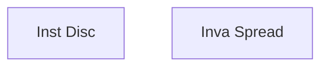

# Metric Learning

Git to learn: https://github.com/KevinMusgrave/pytorch-metric-learning

Google Landmark Recognition Challenge: https://www.kaggle.com/c/landmark-recognition-challenge

Whale identification competition https://www.kaggle.com/c/human-protein-atlas-image-classification/discussion/67819

**Find the nearest samples to compare**

*1.When someone want to label or learn to label an image or check the quality, he can get the nearest images for referring to.
2.We can cluster the images by the metric and find the label noises and then improve the quality of the labels.
3.We can explain why the model is good by visualizing the predictions.*

一种较好的做法，是丢弃经典神经网络最后的softmax层，改成直接输出一根feature vector，去特征库里面按照Metric Learning寻找最近邻的类别作为匹配项。

# Contrastive Learning: A General Self-supervised Learning Approach

https://www.youtube.com/watch?v=7YBwnc9D2d4

# Contrastive Learning 

# 对比学习论文综述【论文精读】

用于无监督..

**Inst Disc: Unsupervised Feature Learning via Non-Parametric Instance Discrimination**

个体判别任务想把把每一个个体区分开来, 

memory bank store every feature

Image2vec separate each instance

**Unsupervised Embedding Learning via Invariant and Spreading Instance Feature**

*Inva Spread*

负样本来自同一个mini-batch -> end-to-end 

但是字典要足够大(负样本够多),所以效果差于simCLR 

**Representation Learning with Contrastive Predictive Coding**

CPC

生成式的代理任务

未来的序列是正样本，其他生成的序列是负样本

普适的用于音频，视频，语言等

**Contrastive Multiview Coding**

CMC

想学习到一个视角不变性的特征

4个视角(多模态)，互为正样本

缺点是对于不同的视角需要配不同的编码器，计算代价比较高

**Momentum Contrast for Unsupervised Visual Representation Learning**

MoCo

归纳为字典查询问题， 队列 (query? key?)

1.动量编码器

2.写作厉害.. 仔细看 (自顶向下)

- 为什么无监督做的不好，总结前面的方法..大一统的框架(Scope)
- 先从Loss 入手讲定义，再去网络结构

3.无监督 > 有监督

**Simple Framework for Contrastive Learning of Visual Representations**

simCLR

同一batch size (大), 

图像x -> 增强 (正样本) -> 编码 （2048维度 -> projector

**Projector：** 一层mlp 提点10个点？只用于训练

8台 8卡机 （V100)

normalised-temperature scale (L2+ *tao) ~ Intro NCE

对比学习需要很强的增强技术..

那些有用, 那些没用 -> 数据消融…

**Improved Baselines with MoCo Learning**

MoCo v2

拿来了 simCLR 的方法

**MLP**，aug+, lr_cos

**BigSelf-Supervised Models are Strong Semi-supervised Learners**

simCLR v2

如何做半监督?

自监督-大模型，小数据labeled 做fine-tune

类似 noisy student ( JFT 300数据集 )

how v1 -> v2 ?

Res 50 -> Res-152 + selective kernels (SK)

MLP 两层效果最好

使用动量编码器 ~ 1%，解决batch不能太大问题

**Unsupervised Learning of Visual Features by Contrasting Cluster Assignments**

SwAV (Swap Assignment Views) 换位预测..

不去跟负样本比， 而是更一些更简洁的东西比？

比如聚类的中心.. 比如imagenet上的3000个center

z1 .* q2 can be used for predict the q1

Trick:

**Multi-crop**： 

以前是一个大image crop两个区域作为正样本。 2*224

现在用多个小crop。

但计算成本上升，所以做取舍， 2\*160， 4\*96.

**Bootstrap Your Own Latent A New Approach to Self-supervised learning**

**BYOL**

没用负样本, 以前会模型坍塌 (全输出为0)

view: 不一样的增广

预测，而不是比较。上相当于query编码，下相当于key编码。

用的MSE loss

很小的细节：BN很重要… 

running mean, running variance…. 信息泄漏(隐式的负样本)， 但是故事讲不圆了。

**BYOL works even without batch-size statistics**

Group norm & weight standardization ….

原来是用在 ResNet v2

**Exploring simple Siamese Representation Learning**

SimSiam, Kaiming

Stop Gradient ( 可以被理解为EM？)

然后到了vision transformer…

**An Empirical Study of Training Self-supervised Vision Transformers**

MoCo v3，用ViT

 = MoCo v2 + SimSaim

backbone replaced by ViT (大 batch 结果会下降…)

A Trick for Improving Stability:

查一下梯度 （波峰 发生在第一层， tokenization这一步）

..freeze 第一层 ->解决了这个问题

**Emerging Properties in Self-Supervised ViT**

**DINO**

拿出来自注意力图，非常准..

Self-distillation with no labels.. 

ema?

sg: stop gradient..

**Need to Learning**

Yann Le Cun 的paper

deep cluster, dc2， SeLA

TPU

NCE Loss? Intro NCE

simCLR v2, **cpc v2**, info min

MoCo

增强 – 对比学习？

bench backbone 基线模型 Res 50 -> feature 128v
