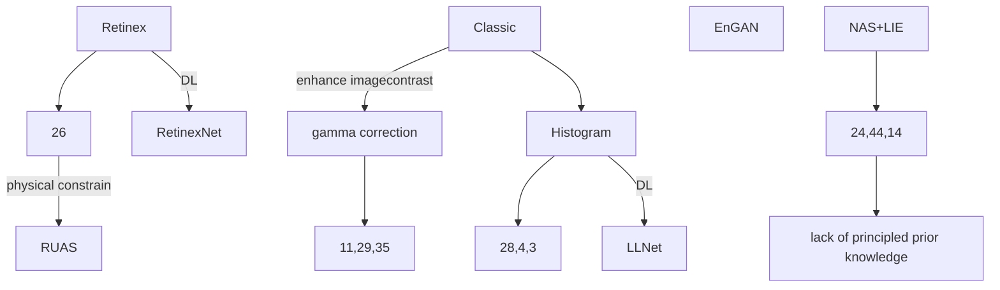

> Enlight the Darkness.

# Low-light Image Enhancement (LIE)

Conf:

CVPR/ICCV/ECCV (B)

NIPS, ICML, ICLR (open review, no rank..)

AAAI, IJCAI, SIGGRAPH, ACM MM

**Journal**: TPAMI, IJCV, TIP

**RUAS : Retinex-Inspired Unrolling With Cooperative Prior Architecture Search for Low-Light Image Enhancement, CVPR 2021** 

[[local](file:///C:/PaperSet/Liu_Retinex-Inspired_Unrolling_With_Cooperative_Prior_Architecture_Search_for_Low-Light_Image_CVPR_2021_paper.pdf)] [[pdf](https://openaccess.thecvf.com/content/CVPR2021/papers/Liu_Retinex-Inspired_Unrolling_With_Cooperative_Prior_Architecture_Search_for_Low-Light_Image_CVPR_2021_paper.pdf)] [[supp](https://openaccess.thecvf.com/content/CVPR2021/supplemental/Liu_Retinex-Inspired_Unrolling_With_CVPR_2021_supplemental.pdf)] [[arXiv](http://arxiv.org/abs/2012.05609)]

**Step:**

1. Characterize the **latent structure** from low-light image in the real-world noisy scenario
2. Then by unrolling the corresponding optimization processes, we establish the h**olistic propagation structure** of our enhancement network.
3. Provide a reference-free bilevel learning strategy to cooperatively **search prior architectures** for
   the illumination map and desired image.

**Contribution:**

1. RUAS first provides a **principled manner** to build our fundamental network structure and
   then automatically discover the embedded atomic prior architectures.

2. Develop a cooperative bilevel search strategy is able to simultaneously discover architectures
   from a compact search space for both illumination estimation and noise removal.

**Enhancement Network**

- unrolling the optimization process of Retinex-inspired models.

Imply Retinex rule:
$$
\mathbf y = \mathbf x \otimes \mathbf  t
$$
where $\mathbf y$ and $\mathbf x$ denotes the desired recovery and the captured underexposed observation, respectively.

Furthermore, $\mathbf t$ denotes the illumination map and $\otimes$ represents element-wise multiplication.

**Illumination Estimation Module (IEM)**: estimate the illumination map

Define an intermediate image $\mathbf u$,

illumination map $\mathbf{t}_{k}$ is at the $k$-stage of IEM, i.e., $\mathbf{t}_{k}=\mathcal{S}\left(\mathbf{u}_{k}\right)$ with
$$
\mathcal{S}\left(\mathbf{u}_{k}\right):=\left\{\begin{array}{l}
\max _{c \in \Omega(z)} \mathbf{y}(c), k=0 \\
\max _{c \in \Omega(z)} \mathbf{u}_{k}(c)-\gamma \mathbf{r}_{k}, k \geq 1
\end{array}\right.
$$
Here $\mathbf{u}_{k}$ is obtained by $\mathbf{u}_{k}=\mathbf{y} \oslash \mathbf{t}_{k}$, where $\mathbf{t}_{k}$ is the estimated illumination map in the last stage and $\oslash$ denotes the element-wise division. Furthermore, $\Omega(z)$ is a region centered at pixel $z$ and $c$ is the location index within this region (for three **color channels**). 

As for the residual $\mathbf{r}_{k}=\mathbf{u}_{k}-\mathbf{y}$ (with penalty parameter $0<\gamma \leq 1$ ), we actually introduce this term to adaptively suppress some overexposed pixels for $\hat{\mathbf{t}}_{k}$ during the propagation.

The principle behind this term is that the illumination is at least the maximal value of a certain location and can be used to handle non-uniform illuminations.

With the illumination warm-start $\mathbf{t}_{k}$, we further refine $\mathbf{t}$ by solving the following model inspired by the work in [9]: $\min _{\mathbf{t}} \frac{1}{2}\left\|\mathbf{t}-\hat{\mathbf{t}}_{k}\right\|^{2}+\phi(\mathbf{t})$, where $\phi(\cdot)$ represents a regularization. 

just write a schematic gradient descent scheme $^{1}$
$$
\mathbf{t}_{k+1}=\hat{\mathbf{t}}_{k}-\partial_{\mathbf{t}} \phi\left(\mathbf{t}_{k}\right),
$$
and parameterize $\partial_{\mathbf{t}} \phi\left(\mathbf{t}_{k}\right)$ by a $\mathrm{CNN}$ architecture $\mathcal{C}_{\mathrm{IEM}}\left(\mathbf{t}_{k}\right)$. By performing $K$ stages of the above calculations, we can obtain $\mathbf{u}_{K}=\mathbf{y} \oslash \mathbf{t}_{K}$ as the output of IEM. 

**Problem:** where is $t$? and how the loss term works?

**Noise Removal Module (NRM)**: suppress noise in some challenging low-light
scenario.

another optimization unrolling module

we define a regularized model: $\min _{\mathrm{x}} \frac{1}{2}\left\|\mathrm{x}-\mathbf{u}_{K}\right\|^{2}+$ $\psi(\mathrm{x})$, where $\psi$ denotes the prior regularization on $\mathrm{x}$. By adopting the same unrolling strategy used in IEM, we can update our desired image $x$ by
$$
\mathbf{x}_{n+1}=\mathbf{u}_{K}-\partial_{\mathrm{x}} \psi\left(\mathbf{x}_{n}\right)
$$
Here we write $\mathcal{C}_{\mathrm{NRM}}\left(\mathrm{x}_{n}\right)$ as the parameterization (i.e., $\mathrm{CNN}$ architecture) of $\partial_{\mathrm{x}} \psi\left(\mathrm{x}_{n}\right)$ and denote the output of NRM (with $N$ stages) as $\mathrm{x}_{N}$ in parallel.

### Cooperative Architecture Search

discover architecture, weight and parameters for both IEM and NRM.

Search Space as distillation cell in [17], which is a directed acyclic graph with five nodes and
each node connects to the next and the last nodes [Fig 2.(d)].

n-C for Conv of kernel  n

RC for residual Conv, 3-2-DC for 3x3 Dilation Conv with dilation rate of 2, SC for skip connection.

They focus on engage important light enhancement factors (e.g., illuminations and noises).

**Result:**

**LLNet: A deep autoencoder approach to natural low-light image enhancement**

[[LLNet.pdf](file:///C:/PaperSet/LLNet.pdf)] [[download](https://www.sciencedirect.com/science/article/pii/S003132031630125X/pdfft?isDTMRedir=true&download=true)] [Citation: 489]

LLNet use one AE for contrast enhance & denoise

S-LLNet use two AE trained on **sythetic dark images** and noisy images only, respectively.

Loss = MSE + KL_Divergence + Regularization

The sparsity regularized reconstruction loss as described in Xie et al. [25]:
$$
\begin{aligned}
\mathcal{L}_{\mathrm{DA}}(\mathcal{D} ; \theta)=& \frac{1}{N} \sum_{i=1}^{N} \frac{1}{2}\left\|y_{i}-\hat{y}\left(x_{i}\right)\right\|_{2}^{2}+\beta \sum_{j=1}^{K} \operatorname{KL}\left(\hat{\rho}_{j} \| \rho\right) \\
&+\frac{\lambda}{2}\left(\|W\|_{F}^{2}+\left\|W^{\prime}\right\|_{F}^{2}\right)
\end{aligned}
$$
where $N$ is the number of patches, $\theta=\left\{W, b, W^{\prime}, b^{\prime}\right\}$ are the parameters of the model, $\operatorname{KL}\left(\hat{\rho}_{j} \| \rho\right)$ is the Kullback-Leibler divergence between $\rho$ (target activation) and $\hat{\rho}_{j}$ (empirical average activation of the $j$ th hidden unit) which induces sparsity in the hidden layers:
$$
\operatorname{KL}\left(\hat{\rho}_{j} \| \rho\right)=\rho \log \frac{\rho}{\hat{\rho}_{j}}+(1-\rho) \log \frac{1-\rho}{1-\hat{\rho}_{j}}
$$

- Attention Guided Low-Light Image Enhancement with a Large Scale Low-Light Simulation Dataset, 2019 

  [download](https://link.springer.com/content/pdf/10.1007/s11263-021-01466-8.pdf) [Citation: 40]

  这篇论文提出了一个attention指导的多分支网络，使用ue-attention map和noise map进行指导

  合成新数据方法

**Attention Guided LLIE, IJCV 2021**

- MSR-net Low-light Image Enhancement Using Deep Convolutional Network
- EnlightenGAN Deep Light Enhancement without Paired Supervision 
- Underexposed Photo Enhancement Using Deep Illumination Estimation(CVPR2019)
- Zero-Reference Deep Curve Estimation for Low-Light Image Enhancement， CVPR 2020

- Mbllen Low-light image video Enhancement Using CNNs（BWVC18）
- Attention-guided Low-light Image Enhancement(arxiv19.8)
- Progressive Retinex: Mutually Reinforced Illumination-Noise Perception Network for Low Light Image Enhancement(ACMMM2019)
- 
-  Kindling the Darkness:A Practical Low-light Image Enhancer(arxiv19.5)** 

