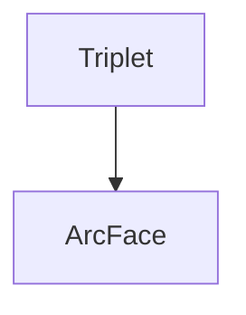

> Metric is to measure the distance between instances. 

### Metric Learning

- **ArcFace** - Additive Angular Margin Loss for Deep Face Recognition

[PDF](https://arxiv.org/pdf/1801.07698v3.pdf), [Code](https://github.com/deepinsight/insightface), [ArcFace.pdf](file:///C:/PaperSet/ArcFace.pdf), (citation)

The proposed ArcFace has a clear geometric interpretation due to the exact
correspondence to the geodesic distance on the hypersphere.

Based on the centre and feature normalisation, all identities are distributed on a hypersphere. To enhance intraclass compactness and inter-class discrepancy, we consider four
kinds of Geodesic Distance (GDis) constraint. (A) Margin-Loss:
insert a geodesic distance margin between the sample and centres.
(B) Intra-Loss: decrease the geodesic distance between the
sample and the corresponding centre. (C) Inter-Loss: increase the
geodesic distance between different centres. (D) Triplet-Loss: insert
a geodesic distance margin between triplet samples. In this
paper, we propose an Additive Angular Margin Loss (ArcFace),
which is exactly corresponded to the geodesic distance (Arc) margin
penalty in (A), to enhance the discriminative power of face
recognition model. Extensive experimental results show that the
strategy of (A) is most effective.

two main lines of research to train DCNNs
for face recognition. the softmax-loss-based
methods [6] and the triplet-loss-based methods

which can separate different identities in the training
set, such by using a softmax classifier [33, 24, 6], and
those that learn directly an embedding, such as the triplet
loss

drawbacks.
For the softmax loss: (1) the size of the linear transformation
matrix W 2 Rdn increases linearly with the
identities number n; (2) the learned features are separable
for the closed-set classification problem but not discriminative
enough for the open-set face recognition problem. For
the triplet loss: (1) there is a combinatorial explosion in the
number of face triplets especially for large-scale datasets,
leading to a significant increase in the number of iteration
steps; (2) semi-hard sample mining is a quite difficult problem
for effective model training.
