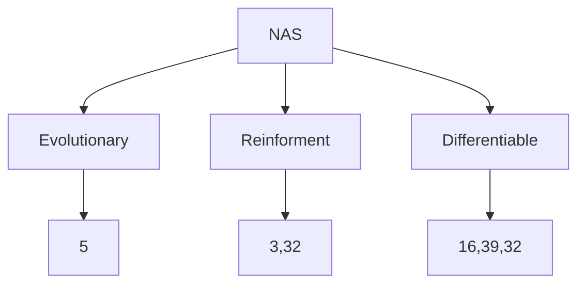
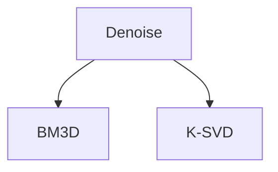

```mermaid
graph TD
   NAS --> Evolutionary --> 5
   NAS --> Reinforment --> 3,32
   NAS --> Differentiable --> 16,39,32
   
```

By adopting the continuous relaxation
technique used in differentiable NAS literature [16, 39, 15],

```mermaid
graph TD
   Denoise --> BM3D
   Denoise --> K-SVD
   
   
```

uncertainty principle
