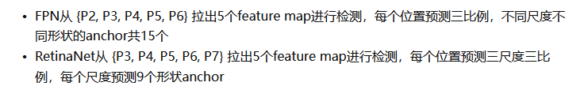

### How Do Anchor Boxes Work?

The position of an anchor box is determined by mapping the location of the network output  back to the input image. The process is replicated for every network output. The result produces a set of tiled anchor boxes across the entire image. Each anchor box represents a specific prediction of a class. For example, there are two anchor boxes to make two  predictions per location in the image below.

**Downsampling**

To fix localization errors, deep learning object detectors learn offsets to apply to each tiled anchor box refining the anchor box position and size.

To generate the final object detections, tiled anchor boxes that belong to the        background class are removed, and the remaining ones are filtered by their confidence score

### Faster R-CNN

anchor为三尺度{128, 256, 512}三比例{1:1, 1:2, 2:1}

### SSD

### FPN

Anchor out put:  (X, Y, Height, Width)

